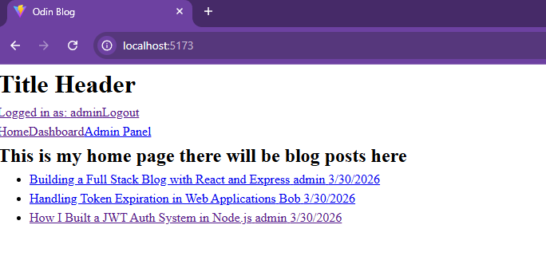
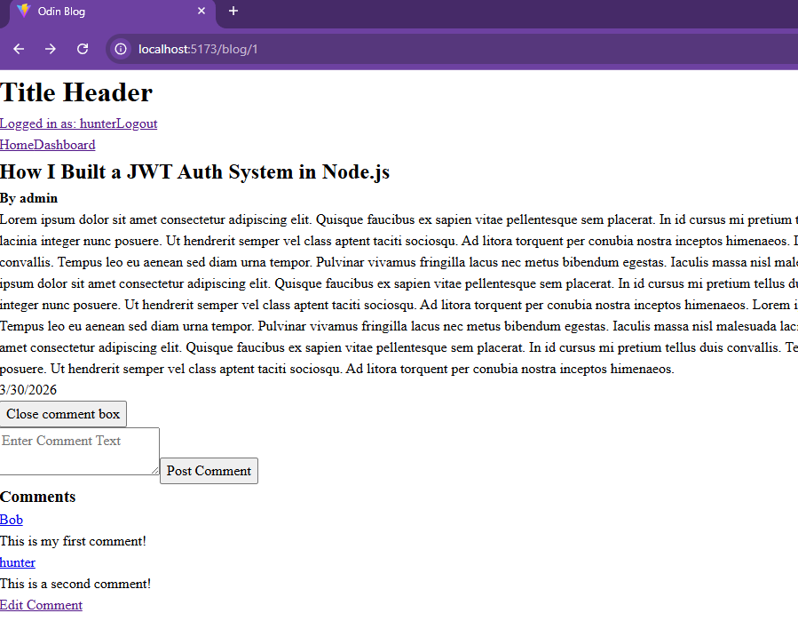
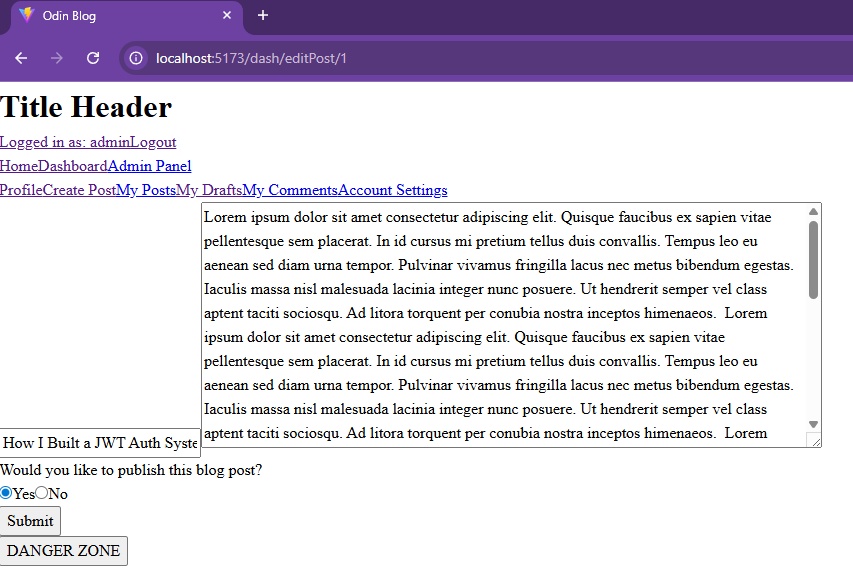
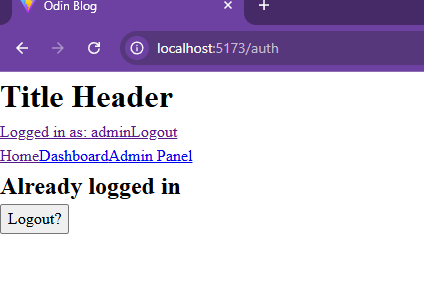

# 📘 OdinBlog – Full Stack Blog Platform
## 🚀 Overview

OdinBlog is a full stack blog application that allows admin-approved users to create and publish posts, while authenticated users can comment and interact with content.

This project focuses on building real-world application patterns, including authentication, protected routes, and coordinated frontend/backend data handling using modern React tools.

The application follows a client-server architecture, with a React frontend consuming a REST API built with Express and Prisma.

## 🧰 Tech Stack
#### Frontend
- React
- React Router (loaders & actions)
- JavaScript (ES6+)

#### Backend
- Node.js
- Express

#### Database
- PostgreSQL
- Prisma ORM

#### Authentication
- JWT (JSON Web Tokens)
- httpOnly cookies
- Access + refresh token flow

### 🔐 Authentication System

This project implements a secure authentication flow designed to maintain user sessions while protecting sensitive data.

- Access token used for authenticated API requests
- Refresh token stored in httpOnly cookie (not accessible via JavaScript)
- Token expiration handling
- Automatic token refresh:
    - On page reload
    - On failed authenticated requests (retry once)

This allows users to stay logged in without exposing sensitive tokens to the client.

### ✨ Features

- Admin-controlled publishing system
- Create, edit, and publish blog posts
- User authentication and protected routes
- Comment system (create, edit, delete)
- User profiles with post/comment visibility
- API-driven communication between frontend and backend

### 🧠 What I Learned  
  
- Designing and implementing JWT authentication systems  
- Handling token expiration and refresh securely  
- Structuring full stack applications with clear separation of concerns  
- Using React Router loaders/actions for data fetching and mutations  
- Coordinating frontend and backend state in authenticated apps  
- Debugging async workflows and edge cases  

### 🚧 Current Improvements  

This project is actively being developed. Planned improvements include:  
- Pagination for posts and comments  
- Additional security hardening  
- Admin panel for managing users and content  
- Improved UI/UX and responsive design  

### 📋 Prerequisites

- Node.js (v18+ recommended)
- PostgreSQL installed and running
- npm or yarn

### 🛠️ Getting Started

1. Clone the repository

        git clone https://github.com/TurnerHelical/odinblog.git
        cd odinBlog

2. Install dependencies

    - Backend
        - `cd odinBlog/apps/api`
        - `npm install`


    - Frontend
        - `cd odinBlog/apps/web`
        - `npm install`


3. Create your database

    - Create a PostgreSQL database and update your `DATABASE_URL` in the `.env` file to point to it.

4. Environment Variables

    - Create a .env file in your backend directory:

        ```env
        PORT=your_port
        DATABASE_URL=your_database_url
        JWT_ACCESS_SECRET=your_secret  
        JWT_REFRESH_SECRET=your_secret
        JWT_ACCESS_EXPIRES=access_expiration
        JWT_REFRESH_EXPIRES=refresh_expiration
        CLIENT_URL=frontend_url    
    Place this file in `odinBlog/apps/api`.

    - Create a .env file in the frontend directory:
        ```env
        VITE_API_BASE_URL=your_api_url
    Place this file in `odinBlog/apps/web`.

5. Run the app

    - Start backend
        - `cd odinBlog/apps/api`
        - `npm run setup` 

        - To create a test admin account for posting blogs, add the following to your backend .env

            ```env
            SEED_ADMIN_EMAIL=admin@example.com
            SEED_ADMIN_PASSWORD=changeme123
            SEED_ADMIN_USERNAME=admin  
            ```
            - Then run:
                - `npm run seed:admin`
                - *(optional)*
            
        - `npm run dev`

    - Start frontend
        - `cd odinBlog/apps/web`
        - `npm run dev`

6. Open in browser
    - Open your browser and navigate to: http://localhost:5173

### 🔑 Test Credentials (Optional)

If you ran the seed script:

- Email: admin@example.com
- Password: changeme123

### 📌 Notes  

This project is not currently deployed and is intended to be run locally.  
Focus is on architecture, authentication, and full stack design rather than final UI polish.

### 📷 Screenshots

#### Blog Feed
Displays published blog posts fetched from the backend.  


#### Blog Post & Comments
Users can view posts and interact through comments.  


#### Create/Edit Post (Admin)
Admin users can create and publish blog posts.  


#### Authentication (Logged In State)
Authenticated users gain access to protected routes and features.  


### 👤 Author

Hunter LeClair
GitHub: https://github.com/TurnerHelical
